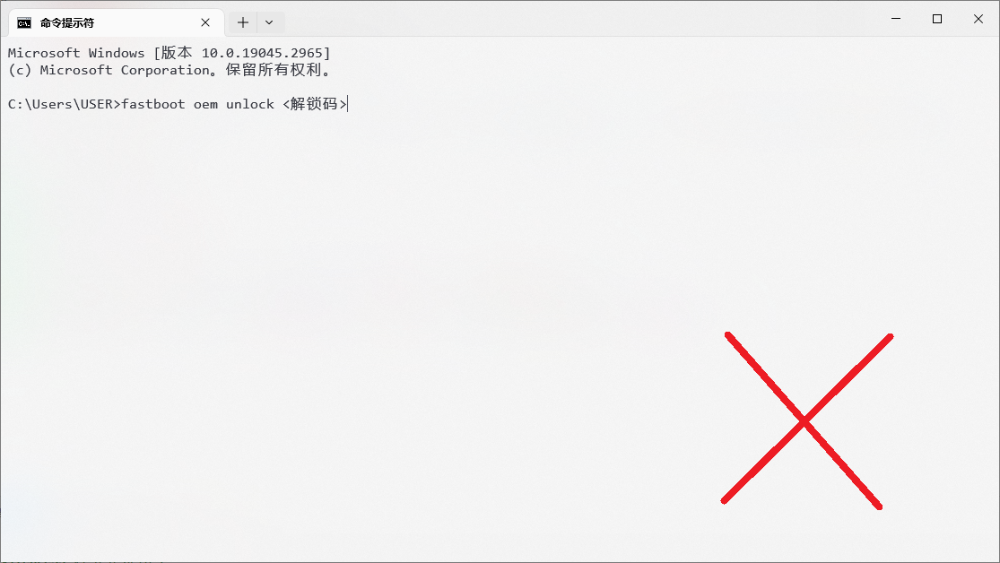
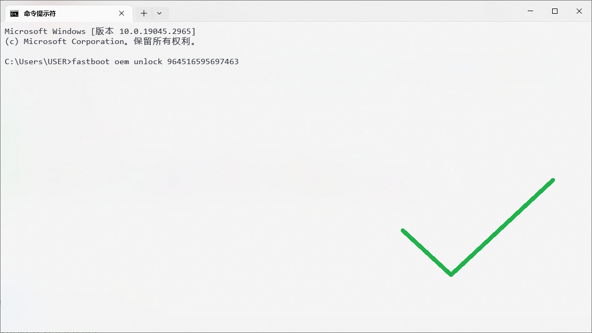

# 文档说明

## 链接跳转

所有颜色为蓝色的，或鼠标悬浮上有下划线的文字**均可点击跳转**。（比如[这段文字](#命令怎么用)，点击它会跳转到此文档的 `命令怎么用` 部分）

部分链接会带有箭头“<a target="_blank"></a>”，表示点击后会跳转到外部链接。

如果您遇到不懂的地方，但是文档内恰好标蓝，您可以点进去了解更多信息。

::::: tip
受主题影响，部分链接可能不起眼。比如[这段文字](#命令怎么用)。如果您发现一段文字上拥有了下划线，那么这段文字就可能支持跳转。

:::: details 部分样式演示（点击可展开）
::: info

* 我是正常文字
* [我是链接文字](#命令怎么用)

:::
::: tip

* 我是正常文字
* [我是链接文字](#命令怎么用)

:::
::: warning

* 我是正常文字
* [我是链接文字](#命令怎么用)

:::
::: danger

* 我是正常文字
* [我是链接文字](#命令怎么用)

:::
::: details

* 我是正常文字
* [我是链接文字](#命令怎么用)

:::
::::
:::::

## 文字加粗

本文档会在一些地方加粗文字，**强调一些内容**，或者**标记一些关键信息**。

## 命令怎么用

::: danger

文档内给出的所有命令**假设您已经安装了相关工具**。如果您未安装相关工具（如 ADB），请参考[《Platform-Tools 下载与安装》](/tools/platform-tools.md#platform-tools-下载与安装)。
:::

如果您有其他命令相关问题，请参考[《命令相关问题》](./knowledge.md#命令相关问题)

### 命令输入需要更改内容吗

命令不是给啥就输入啥的。您要按照实际情况输入变通。

::: tip

* `[...]`：可写可不写
* `{...}`：必须要在 `{}` 内给出的选择里选一个。
* `<...>`：必选参数
* 注：部分文档省略了这些括号，但**不代表不需要替换掉**！

您可以参考这篇文章查看更多信息：<https://www.cnblogs.com/XingXiaoMeng/p/12634444.html>
:::

比如，您看到这样一段命令

:::: details 🛠命令生成器
您可以在这里直接生成您的命令。

1. 将信息填写到输入框，如果是文件则可以拖入输入框。
2. 复制命令，将命令粘贴到终端内
3. 运行命令

::: tip
注：如果使用生成器生成的命令，需要将终端工作目录切换至文件所在的目录才能继续使用。
:::

<CGInput @change="unlockCode = $event" holder="<解锁码>">解锁码</CGInput>

::::

``` bash-vue :no-line-numbers
fastboot oem unlock {{unlockCode}}
```

这句话的意思是让 fastboot 软件（在这里指的是 `fastboot.exe` ）使用 `{{unlockCode}}` 解锁手机。

在实际输入的时候，**不要原封不动地将 `<解锁码>` 输入到命令行中**，而是用你获取到的解锁码代替 `<解锁码>` 输入。

::: tip
您可以使用“命令生成器”来生成您的指令，之后直接粘贴到终端内就能运行。
:::





### 为什么在一个地方有多个不同的命令

本文档内部分命令有不同的变种，请按照实际情况选择。

## `「 」` 是什么

您可以把它当成双引号： `“ ”`

* [双引号](https://baike.baidu.com/item/%E5%8F%8C%E5%BC%95%E5%8F%B7/10758658) - 百度百科

## 如何下载此文档

如果您的网络不佳，您可以下载此文档到本地后查看。下载之后，启动本地网页服务器，将文档文件复制到服务器根目录的 `FlashAndroidDevicesGuidelines` 文件夹内即可查看文档。

### 现场构建文档

1. 进入仓库，点击“克隆/下载”\
   或者直接点击：<https://gitee.com/Jesse205/FlashAndroidDevicesGuidelines/repository/archive/master.zip>
2. 安装 NodeJS 与 Yarn
3. 运行 `yarn build` ，编译生成文件夹 `.vitepress/dist`

### 预编译文档

敬请期待

<script setup>
import {ref} from 'vue'

const unlockCode = ref('')
</script>
