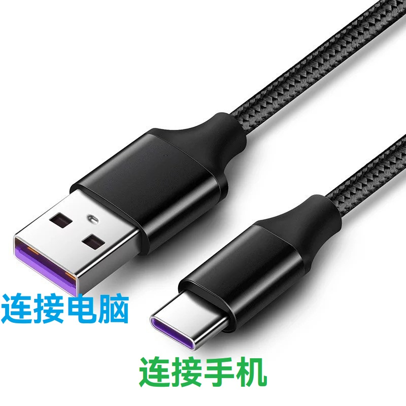
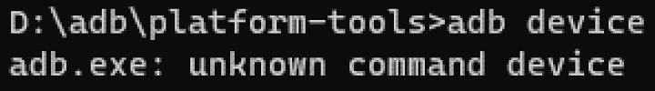

# 基本知识

## 这个文档怎么看

您需要小心翼翼的看，避免遗漏什么内容。（虽然目前内容不太多😂）

[点击此处浏览文档说明](./documents.md)

## 如何将手机/平板链接至电脑

1. 购买一根[数据线](#数据线-是什么-和-充电线-有什么区别)
2. 将数据线的 TypeC 或 Micro 的那一段插入手机/平板（通常是稍微小一点的那段）
3. 将另一头插入电脑

到这里，你的已经完成了手机与电脑的连接。接下来电脑会自动安装驱动，您也可以选择手动安装驱动，但是一般情况下您可以不进行任何操作。

## "数据线" 是什么? 和 "充电线" 有什么区别?
<!-- 请不要修改标题的符号，否则会出现兼容性问题 -->

数据线可以传输数据，充电线不能传输数据

关于数据线，您可以参考[《[名词集] 数据线》](../normal/noun.md#名词集)

## 手机连电脑没反应怎么办

补驱动，换数据线，换电脑插口（台式机最好是后置插口），关闭USB选择性暂停。

## 命令相关问题

### 指令无效

`'XXXX' 不是内部或外部命令，也不是可运行的程序或批处理文件`

`adb.exe: unknown command XXXX`

输入命令回车后显示 `adb.exe: unknown command XXXXX` 或 `不是内部或外部命令，也不是可运行的程序或批处理文件`，则表示“输入的指令无效”

这表明系统找不到相应的软件或者指令出现了语法错误，

* 如果你用的是网上的一键刷入工具，**请将压缩包完全解压再运行 bat 脚本**。注意是完全解压而不是直接运行压缩包里的脚本。
* 如果你是手输命令，可能是出现了**单词拼写错误**，有**多余/缺少空格**等问题，这时需要检查输入的指令是否正确。

如果仍然不能解决，尝试更换为系统自带的微软输入法并切换至英文后输入。

## 为什么这里没有我要的答案

这个页面是为小白准备的。详细的内容在[《常见问题与解答》](./index.md)内
