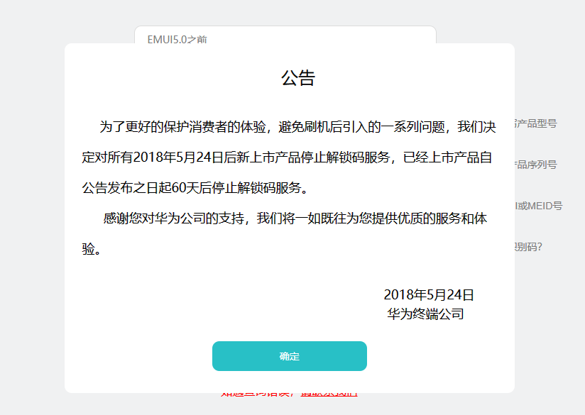

---
next:
  text: '下载 ROM'
  link: '/fast/download/'
---
# 华为解锁

## 硬件要求

- 装有 [ADB 工具](/tools/platform-tools.md#adb-工具)的电脑
- 华为手机（系统为 EMUI 9 及以下，但是如果你的华为设备搭载 MTK 芯片的话，即使是鸿蒙系统也有可能解锁，比如华为畅享20系列，20se（PPA）除外）

## 解锁步骤

### 一、申请解锁码

华为在 2018 年 5 月 24 日已关闭解锁码申请通道，如果您拥有时光机，请前往这个时间段前进入 EMUI 官网的[解锁](https://emui.huawei.com/cn/unlock_index)进行解锁😁。



您也可以通过第三方渠道获取解锁码或者直接解锁 Bootloader。

- 使用 [PotatoNV](https://github.com/mashed-potatoes/PotatoNV) 解锁 <Badge type="tip" text="免费" /> [查看教程](https://zhuanlan.zhihu.com/p/397173427)
- 联系 [@某贼](http://www.coolapk.com/u/3463951) <Badge type="tip" text="免费" />（[某贼之言](https://www.coolapk.com/feed/25219974?shareKey=ZDc3M2ExYmZlNjQ2NjA3MTc2ZGY~)）
- 某宝购买 <Badge type="warning" text="付费" />
- 联系酷安 @stuff233 <Badge type="warning" text="付费" />

::: tip
大佬们有时候可能不在，请耐心等待。
:::

### 二、开始解锁

::: warning
华为部分手机无法通过 ADB 命令直接解锁，因此您可能需要**通过第三方渠道解锁**。

以下方法只适用于老设备。新设备已经关闭了解锁命令，您可能需要**拆机**才可以解锁。
:::

::: danger
解锁会清除手机里所有数据，请提前做好数据备份。
:::

::: tip
解锁之前请**关闭查找手机（不要只退出账号）**，否则无法解锁。解锁后出现黄色开机警告为**正常现象**。
:::

1. 将手机用数据线连接电脑，进入 Fastboot 模式
2. 打开 adb 工具包里的命令行，输入指令（不带尖括号）：

:::: details 🛠命令生成器
您可以在这里直接生成您的命令。

1. 将信息填写到输入框，如果是文件则可以拖入输入框。
2. 复制命令，将命令粘贴到终端内
3. 运行命令

::: tip
注：如果使用生成器生成的命令，需要将终端工作目录切换至文件所在的目录才能继续使用。
:::

<CGInput @change="unlockCode = $event" holder="<解锁码>">解锁码</CGInput>

::::

``` bash-vue :no-line-numbers
fastboot oem unlock {{unlockCode}}
```

> 如果您不知道这是什么意思，请参考[《命令的使用》](/faq/documents.md)

老一点的机型一般直接就解锁了，新一点的手机上可能会出现这样的提示：


这时按音量加键调整到 `Yes` ，再按电源键确认就可以了。

如果手机重启或低级格式化，最终 `Fastboot` 上显示红色 `Unlocked` ，即为解锁成功。

## 确定是否已解锁

- **fastboot 状态**: 如果显示红色的 `PHONE Unlocked`，则手机已解锁。
- **开机第一屏之后**: 如果显示 `Your device has been unlocked and can't be trusted.` ，并且提示文字为橙色，则手机已解锁。

## 解锁完成

解锁完成后可以刷入第三方 ROM、获取 Root 等操作了。

::: tip
如果你是新手，不妨先尝试一下[简单的 Root](/fast/install/root/huawei/index.md)，再考虑刷入其他 ROM！
:::

::: danger
解锁后**赶紧备份手机关键分区**。部分分区在每部手机内是独一无二的，丢了就真丢了，手机也真废了。
:::

## 版权声明

本文档已获得 [@某贼](https://www.coolapk.com/u/3463951) 授权搬运并修改整理

## 参考链接

- [如何Root你的华为旧机？](https://www.coolapk.com/feed/26320412?shareKey=YzZmMjdiZjEwNThjNjEwZDQ5MGI~&shareUid=3463951&shareFrom=com.coolapk.market_11.3) - 酷安：@某贼

<script setup>
import {ref} from 'vue'

const unlockCode = ref('')
</script>
