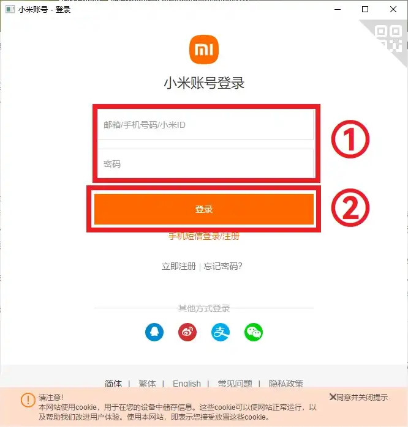
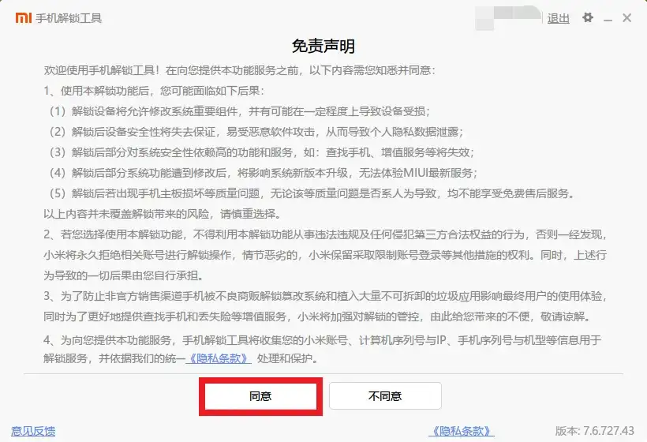
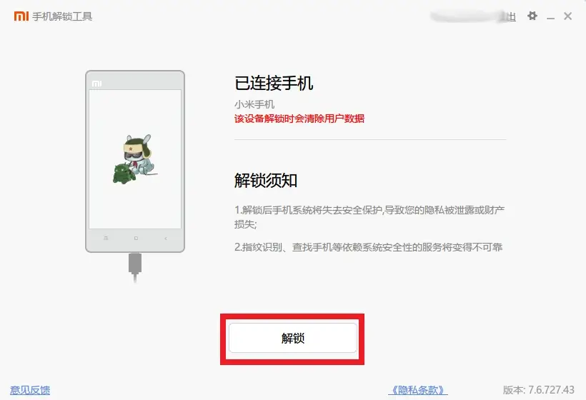
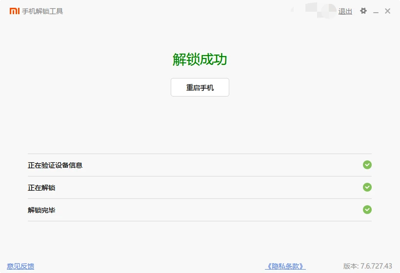
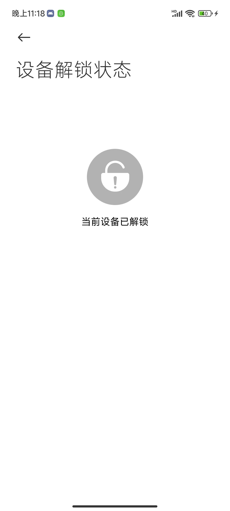

---
next:
  text: '下载 ROM'
  link: '/fast/download/'
---
# 小米解锁

::: tip

小米14系列似乎无法解锁bl

:::

## 硬件要求

- Windows 电脑
- 手机
- 数据线
- **SIM 卡**（用于绑定手机）

## 解锁步骤

### 一、手机端

1. 将 SIM 卡插入手机。
2. 打开开发者模式：
   1. 打开系统 `设置 - 我的设备`。
   2. 找到 `全部参数 - MIUI版本` ，并连续点击此项，直至弹出提示“您已处于开发者模式，无需进行此操作”。
3. 回到 `设置` 一级菜单，进入 `更多设置 - 开发者选项`，找到「OEM解锁」并勾选（如果没有就可以忽略）。
4. 在当前菜单中找到「设备解锁状态」，阅读说明后点击「绑定账号和设备」（需要小米账号并插入 SIM 卡）。
5. 连接电脑，并稍后重启至 fastboot（稍后可能需要验证码登录小米账号）。

::: tip
一般来说，仍需要使用这个手机 168 小时后才能解锁，在解锁前请务必备份手机数据（因为解除 BL 锁会格式化 `data` 分区）。
:::

### 二、电脑端

1. 官网上下载[小米解锁工具](http://www.miui.com/unlock/index.html)
2. 在工具中登录与手机绑定时一致的小米账号。此时可能需要验证码。
3. 手机重启至 [fastboot](/normal/modes/xiaomi.md#fastboot-模式)
   - **按键进入**：关机状态长按 电源键 和 音量减。
4. 根据提示解除 BL 锁。

::: tip
在一段时间内同一个小米账号的解锁数量可能有限。
:::

当电脑端提示完成后，无需触碰手机，等待重启。

若等待较长时间无响应，在电脑上点击「重启手机」，请勿按机身按键。

手机重启后，需要在 WIFI 环境下或 SIM 卡网络下（如果 SIM 卡设置了 pin 码则需使用 WIFI）登录小米账号以激活，激活后就可以正常进入系统了。

## 检查是否已解锁

- **关机状态**：开机时第一屏如果显示一个打开的锁的图标或 `unlock`（较老款手机），表明解锁成功。
- **开机状态**：启用开发者模式，再次进入 `设置-更多设置-开发者选项-设备解锁状态` 查看，若显示“当前设备已解锁”，表明解锁成功。
    

    
    

## 解锁完成

解锁完成后可以刷入第三方 ROM、获取 Root 等操作了。

::: tip
如果你是新手，不妨先尝试一下[简单的 Root](/fast/install/root/index.md)，再考虑刷入其他 ROM！
:::

::: danger
解锁后**赶紧备份手机关键分区**。部分分区在每部手机内是独一无二的，丢了就真丢了，手机也真废了。
:::

## 版权声明

本文档已获得 [@灬只会刷机养老](http://www.coolapk.com/u/11090720) 授权搬运并修改整理

## 参考链接

- [【小白搞机入门】名词集-BootLoader锁（BL锁）](https://www.coolapk.com/feed/42674591?shareKey=YzQ2MThhNmI5MmNiNjNkNTcwOGM~) - 酷安：@灬只会刷机养老
