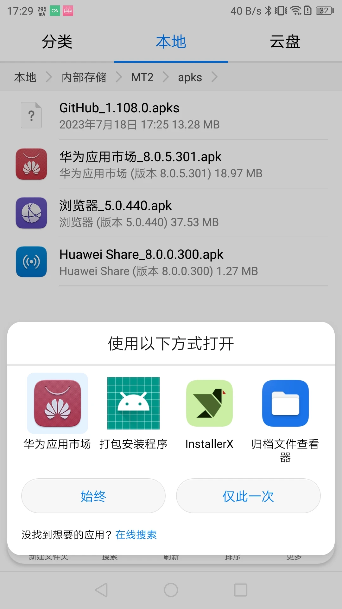
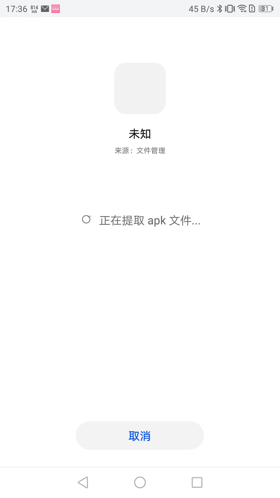
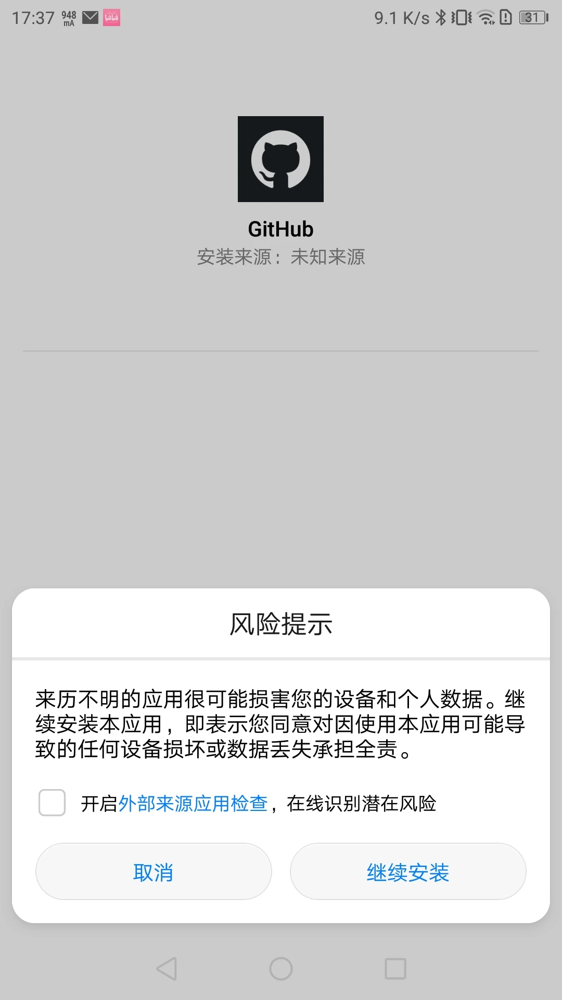
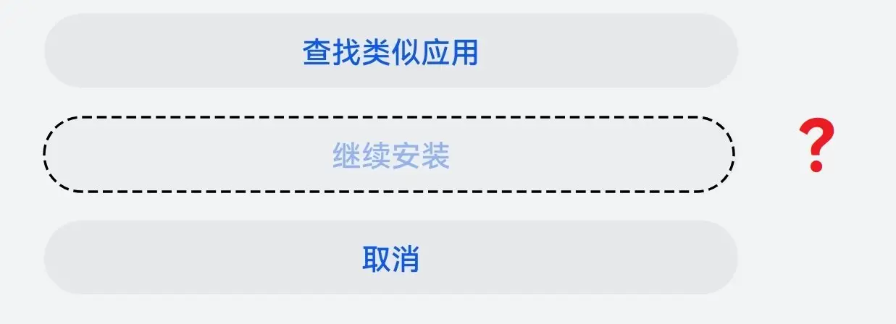
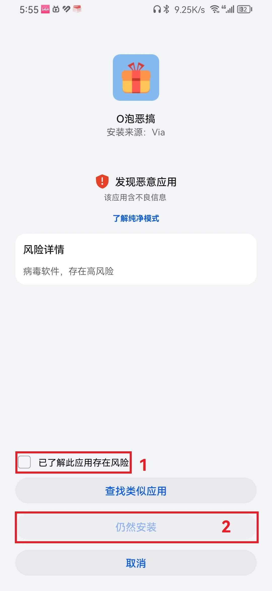
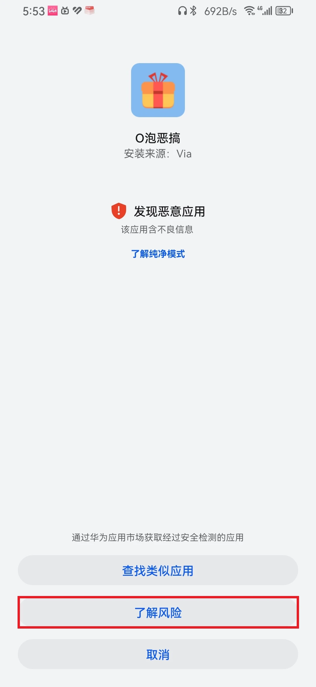
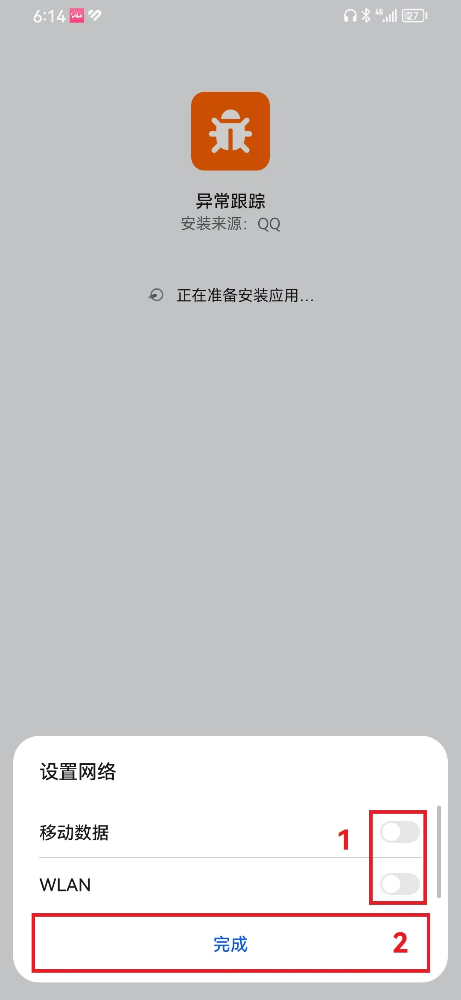
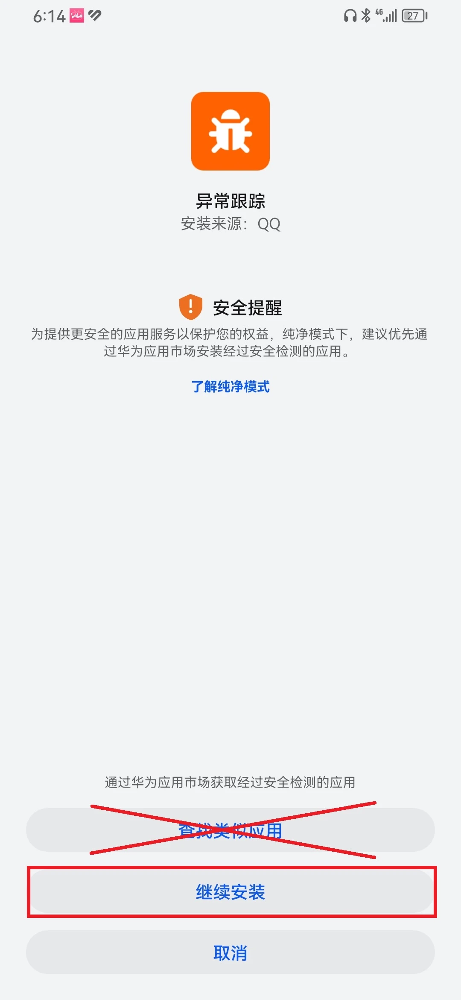

# EMUI 类操作系统安装第三方软件

## 安装本地的软件

### 直接安装 (使用官方安装器)

::: tip
可以在关闭了纯净模式的前提下，使用**华为应用市场**的打开方式来安装 APKS 安装包。
:::

前提条件是按照[通用方法](./index.md#使用第三方安装器安装)打开安装权限。

EMUI 与 HarmonyOS 安装权限设置与原生可能稍微不一样，但操作步骤是差不多的。

#### EMUI 11 及更低版本

这些版本对安装第三方软件基本没有什么限制。

1. [开启“未知来源应用下载”与关闭“外部来源应用检查”](#开启-未知来源应用下载-与关闭-外部来源应用检查)，确保您在安装软件过程中不被系统拦截。
2. 使用[通用方法][InstallNormal]安装软件。

#### HarmonyOS 2

1. [关闭“纯净模式”](#harmonyos-关闭-纯净模式)，确保您在安装软件过程中不被系统拦截。
2. 按照[通用方法][InstallNormal]安装软件。

#### HarmonyOS 3

1. 关闭[“增强防护”](#harmonyos-关闭-增强防护)，允许您安装外部软件。
2. 按照[通用方法][InstallNormal]安装软件。如果安装过程被系统拦截，请参考附录中的解决方法。

::: info

- 华为在 HarmonyOS 3 强制开启了纯净模式，**无法关闭**，您每次安装软件都可能**需要输入密码**，甚至**被系统拦截**。
- 华为又在 HarmonyOS 3 引入了“增强防护”。开启此开关后，您的设备**彻底不能**直接安装应用了。因此您需要[关闭此开关](#harmonyos-关闭-增强防护)。

:::

::: warning
您可以尝试使用修改数据库的方法[强制关闭纯净模式](#harmonyos-关闭-纯净模式)，但是我们**不推荐这样做**。
:::

### 使用第三方安装器安装

与[通用方法](./index.md#使用第三方安装器安装)保持一致。

::: danger
HarmonyOS 3.0 及更高设备可能**无法**将第三方安装器设为默认。

在这种情况下，请不要尝试冻结“应用安装器”，这种行为可能**导致部分数据丢失**（系统会自动重置），严重的会**卡开机动画**（系统不会会自动重置），并且 **ADB 也无法挽救**。
:::

::: tip
HarmonyOS 3.0 以下设备可以使用 **华为应用市场** 直接安装 APKS 安装包，无需使用第三方安装器。

:::

## 通过电脑 (其他设备) 安装软件

与[通用方法][InstallFromOthers]保持一致。

但是要注意的是进入开发者选项[关闭“监控 ADB 安装应用”](#关闭-监控-adb-安装应用)，或者在每次安装时手动确认安装。

## 附录

### 开启 “未知来源应用下载” 与关闭 “外部来源应用检查”

1. 点击“设置”图标，进入系统设置
2. 进入“安全”，进入“更多安全设置”（HarmonyOS 3）、进入“安全和隐私”，点击“更多安全设置”（EMUI8）或进入“高级设置”，进入“安全”（EMUI4）（请按实际情况操作）
3. 开启“未知来源应用下载”与关闭“外部来源应用检查”（如果有）

::: tip
部分系统可能仅有“未知来源应用下载”或“外部来源应用检查”，或什么都没有。您按照实际情况操作即可。
:::

### HarmonyOS 关闭 “纯净模式”

您有两种方法关闭“纯净模式”，但我们推荐您使用官方方法。

- 官方方法：
   1. 点击“设置图标”，进入系统设置
   2. 进入“纯净模式”，并关闭此功能。如果过程中询问您锁屏或者账号密码，请输入正确的密码。
- 修改设置数据库 <Badge type="danger" text="本操作风险太大，作者没有经过测试，请谨慎使用" />
  - 敬请期待

### HarmonyOS 关闭 “增强防护”

关闭此功能的开关与之前[关闭“纯净模式”](#harmonyos-关闭-纯净模式)的开关在一个页面。

1. 点击“设置图标”，进入系统设置
2. 进入“纯净模式”，关闭“增强防护”。如果过程中询问您锁屏或者账号密码，请输入正确的密码。

### HarmonyOS 忽略风险，继续安装

您在安装软件时可能出现风险提示，您**没有**看到“继续安装”按钮，或者安装按钮不可用。您可以试试以下方法继续安装。

#### 火眼金睛

已知适用此方法的报毒类型：

- 该应用含不良信息

操作步骤：

1. 点击“了解更多”（如果有）
2. 勾选“已了解此应用存在的风险”
3. 点击“仍然安装”

这种报毒已知有两种情况，但操作步骤是相同的。

#### 断网大法

此方法适用于界面内不管怎么操作也不能继续安装的情况

已知适用此方法的报毒类型：

- 来源可能被恶意篡改

操作步骤：

1. 关闭 WLAN、移动数据和蓝牙（如果使用蓝牙上网）
2. 重新尝试安装软件

#### 切换来源

此方法适用于不能断网的情况下，但是又急需安装网络

已知适用此方法的报毒类型：

- 来源可能被恶意篡改

操作步骤：

1. 将应用另存为你的文件管理器可以读到的路径内
2. 使用你的文件管理找到该文件进行安装

#### 分身漏洞

在应用分身内，由于分身也是一个用户，因此可能导致某些设置与主用户不保持一致。正是因为这样，华为的分身空间内并未开启纯净模式，因此您可以使用分身应用安装第三方应用。

已知适用此方法的报毒类型：

- 所有类型

操作步骤：

1. 开启 QQ 或微信的分身，并登录您的另一个账号
2. 给您当前分身登录的账号发送您要安装的 APK 文件
3. 在分身内点击文件安装应用
4. 如果询问您是否要允许安装应用，请**一定要点击“是”**
5. 如果询问您是否开启应用检查，请**一定要“取消”**
6. 继续安装应用即可

::: warning
此漏洞在新版本 HarmonyOS 中已修复。
:::

### 关闭 “监控 ADB 安装应用”

如果不关闭此开关，会导致使用第三方应用市场静默安装、使用第三方安装器安装时都会弹出页面确认安装。

操作步骤：

1. 启用“开发人员选项”
2. 进入“开发人员选项”，找到“调试”
3. 关闭“监控 ADB 安装应用”开关

[InstallNormal]: ./index.md#安装本地软件
[InstallFromOthers]: ./index.md#通过电脑-其他设备-安装软件
