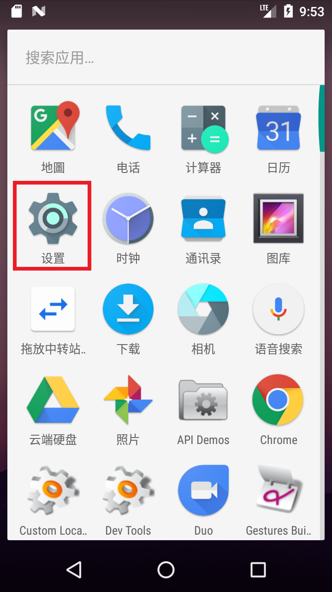
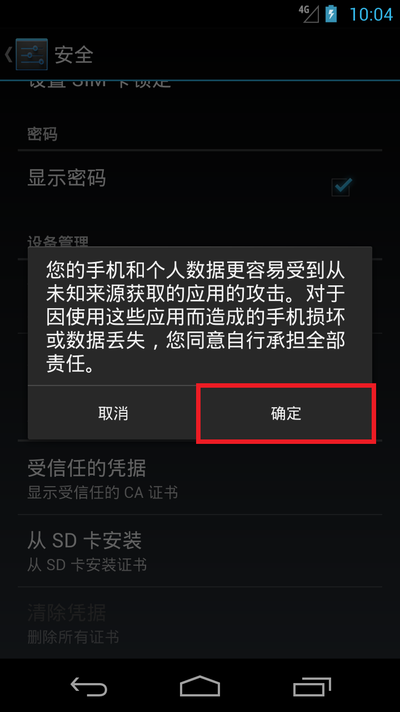
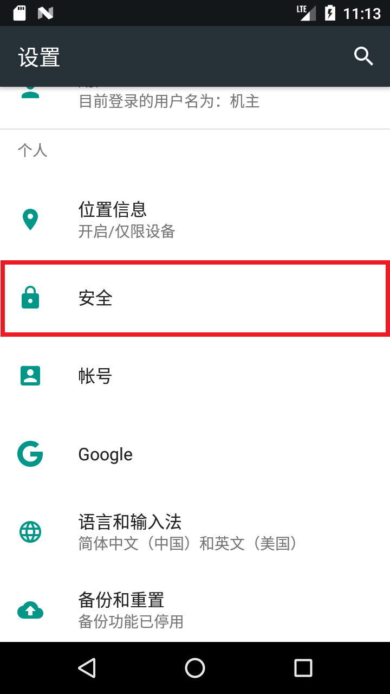
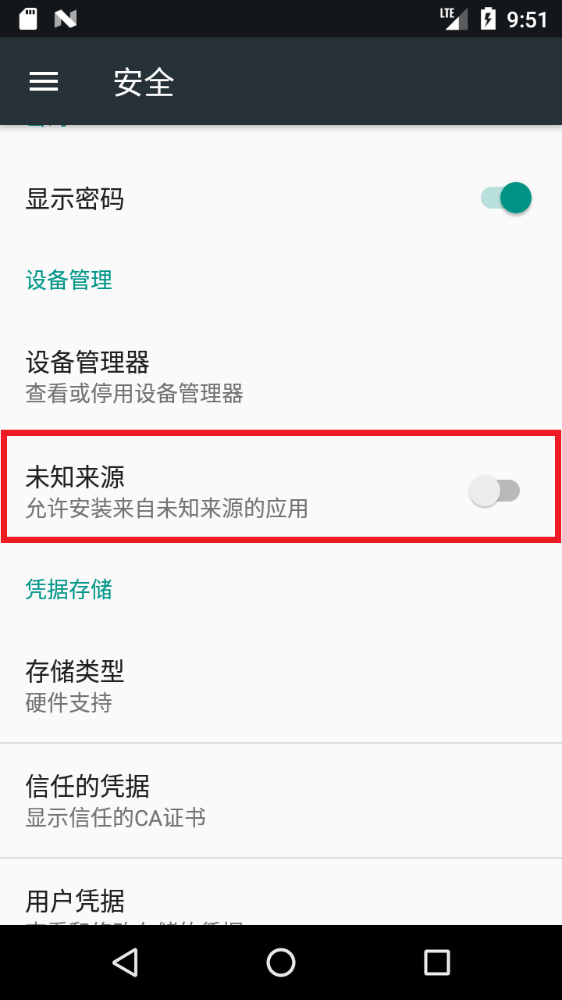
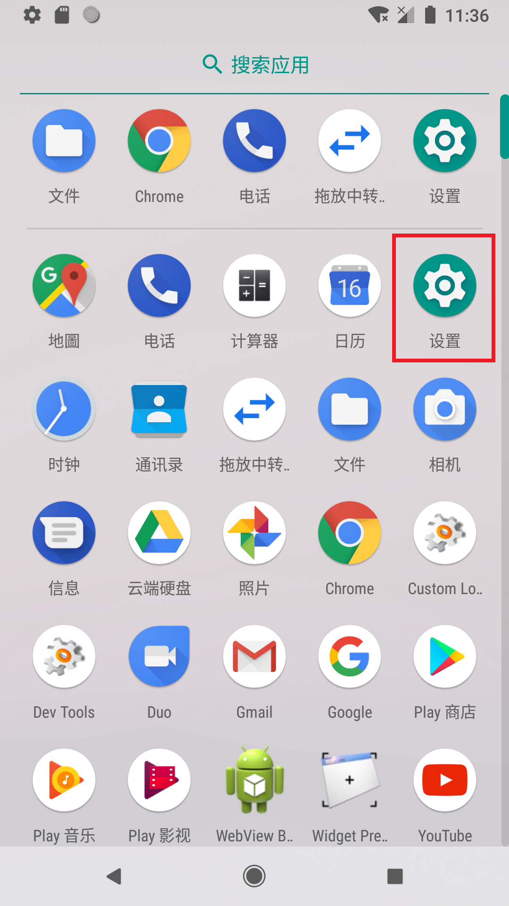
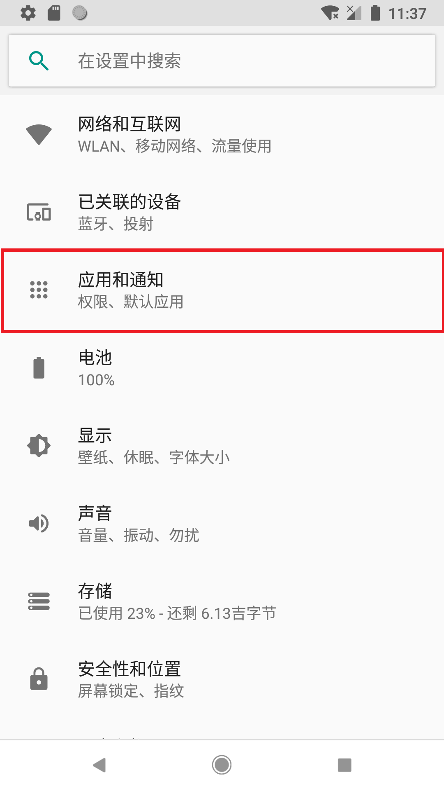
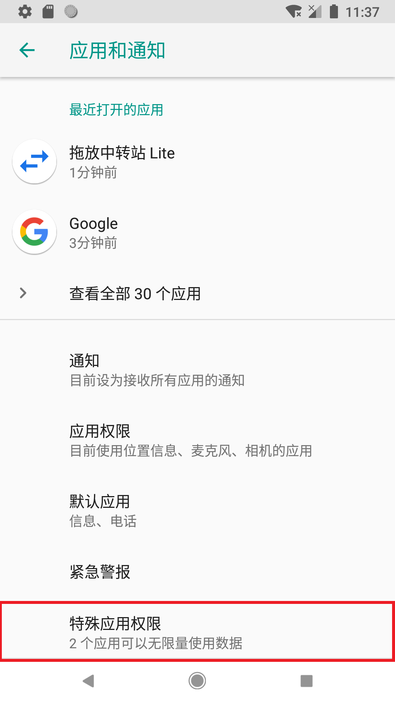

# 安装第三方软件

如今越来越多手机厂商在对安装第三方软件加以限制，以至于我们需要专门阅读文档应对这种情况。

::: tip
此页面是Android 通用的安装教程。您可能需要浏览专门针对您手机系统的文章，但推荐您先阅读完这篇文章后再阅读下面的文章。

* [华为的 EMUI、HarmonyOS 和荣耀的 MagicUI、MagicOS 等 EMUI 系列系统](./emui.md)
* 小米的 MIUI

:::

## 安装本机上的软件

### 一、开启安装权限

::: tip 此部分可以跳过
一般情况下您不需要手动开启安装权限。因为当需要安装软件时，系统会引导您直接开启权限。
<div class="screenshotList">

</div>
:::

#### Android 7及以下

1. 点击“设置”图标，进入系统设置
    <div class="screenshotList">
    
    
    </div>
2. 点击“安全”页面，找到“未知来源”，将其开启/勾选
    <div class="screenshotList">
    
    
    
    
    </div>
    <div class="screenshotList">
    
    
    
    
    </div>

#### Android 8 及以上

1. 点击“设置”图标，进入系统设置
    <div class="screenshotList">
    
    </div>
2. 进入“应用和通知”，点击“高级”（部分手机无此选项），找到“特殊应用权限”并进入
    <div class="screenshotList">
    
    
    
    </div>
3. 找到“安装未知应用”并进入，选择您用于安装第三方软件的应用，打开“允许来自此来源的应用”
    <div class="screenshotList">
    
    
    
    
    </div>

### 二、开始安装软件

#### 使用官方安装器安装

官方的安装器名称为“打包安装程序”、“软件包安装程序”或“应用安装器”。通常情况下，设备默认的就是官方的安装器。

直接点击 APK 文件即可使用官方安装器安装。

::: tip
如果您没有安装权限时，在打开 APK 文件后，系统会提示您开启权限，按照操作开启即可。
<div class="screenshotList">

</div>
:::

::: tip
部分操作系统限制了直接安装软件，因此您需要继续浏览[关于您设备的文章](#安装第三方软件)。
:::

#### 使用第三方安装器安装

主流的安装器：

* InstallerX
* R-安装

## 安装电脑或其他设备上的软件

如果您的安装包不再您的需要安装到的手机上，您可以使用 [ADB](../../tools/index.md#adb) 安装软件

常用命令：

```bash
adb install -r xxx.apk
```

完整命令：

```bash
db install [-l] [-r] [-s] [--algo <algorithm name> --key <hex-encoded key> --iv <hex-encoded iv>] <file>
```

* `-l` 表示向前锁定应用程序
* `-r` 表示重新安装应用程序并保留其数据
* `-s` 表示着安装在 SD 卡上，而不是内部存储
* `--algo` 、`--key` 和 `--iv` 表示着文件已经加密

:::: tip
使用 ADB 安装软件一般情况下不需要给予安装权限。但也有例外的情况。

::: details 例外情况

| 系统    | 版本 | 说明                                                                               |
| ------- | ---- | ---------------------------------------------------------------------------------- |
| EMUI 类 | 未知 | 需要进入开发者选项关闭“监控 ADB 安装应用”，或者在每次安装时手动确认安装。 [查看详情](./emui.md#关闭监控-adb-安装应用) |
| MIUI    | 未知 | 需要进入开发者选项打开“USB安装”，并在每次安装时手动确认安装。                      |

:::

::::

## 参考链接
