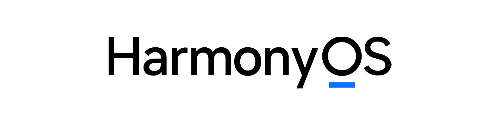
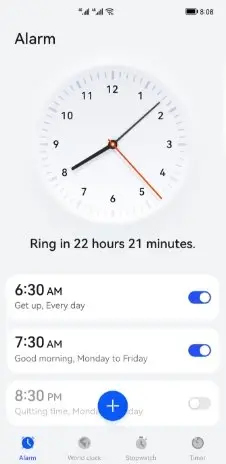
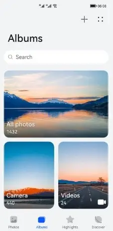
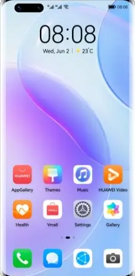
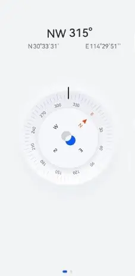
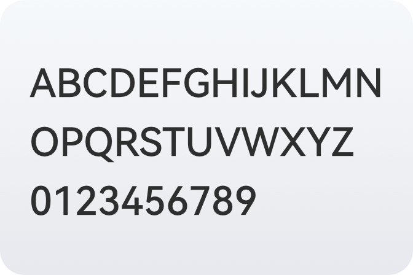

# EMUI 类

HarmonyOS 是新一代的智能终端操作系统，为不同设备的智能化、互联与协同提供了统一的语言，带来简捷、流畅、连续、安全可靠的全场景交互体验。

> 此处待查证

- **官方网站**
  - **HarmonyOS**：<https://www.harmonyos.com>
    - **HarmonyOS 4 官网**：<https://consumer.huawei.com/cn/harmonyos-4/>
    - **HarmonyOS 3 官网**：<https://consumer.huawei.com/cn/harmonyos-3>
    - **HarmonyOS 2 官网**：<https://consumer.huawei.com/cn/harmonyos>
  - **MagicUI**：<https://www.hihonor.com/cn/magic-ui/>
  - **MagicOS**：<https://www.hihonor.com/cn/magic-os/>
- **下载地址**：
  - **官方**：**官方未提供下载渠道**
  - **Huawei Firm Finder** <Badge type="warning" text="第三方" /> ：<https://professorjtj.github.io>

如果您正在寻找关于 EMUI 11 及以下的系统介绍，请阅读 [基础知识 > 操作系统 > EMUI][emui]

## 屏幕截图

- **EMUI 12**：

::: details HarmonyOS 2

:::

## 版本

华为自 HarmonyOS 2 开始，已不再是一个 EMUI 对应一个安卓版本。

### EMUI 版本

| EMUI 版本    | 3.0 | 3.1 | 4.0      | 4.1 | 5.0 | 5.1  | 6.0  | 8.0 | 8.1 | 9   | 10  | 11  | 12   | 13   |
| ------------ | --- | --- | -------- | --- | --- | ---- | ---- | --- | --- | --- | --- | --- | ---- | ---- |
| Android 版本 | 4.4 | 5.0 | 5.0、6.0 | 6.0 | 7.0 | 未知 | 未知 | 8.0 | 8.1 | 9   | 10  | 10  | 未知 | 未知 |

### HarmonyOS 版本

| Android 版本  HMOS 版本 |   9   |  10   |  11   |  12   |  13   |
| -------------------------- | :---: | :---: | :---: | :---: | :---: |
| HarmonyOS 4.0              | 未知  | 未知  | 未知  | 未知  | 未知  |
| HarmonyOS 3.1              | 未知  | 未知  | 未知  | 未知  | 未知  |
| HarmonyOS 3.0              | 未知  |   √   | 未知  |   √   |   X   |
| HarmonyOS 2.1              | 未知  | 未知  |   √   | 未知  |   X   |
| HarmonyOS 2.0              |   √   |   √   | 未知  | 未知  |   X   |

### MagicOS、MagicUI 版本

敬请期待

## 设计

### 用户界面：HarmonyOS Design

<!--@include: ./design/hmos_fragment.md -->

### 字体

#### HarmonyOS Sans <Badge text="HarmonyOS 最新" />

> HarmonyOS Sans字体版权归华为所有

- 字重：Thin / Light / Regular / Medium / Bold / Black
- 语言：简体中文 / 繁体中文 / 拉丁 / 西里尔 / 希腊 / 阿拉伯
- [定制字体 - 汉仪字库](https://www.hanyi.com.cn/orderFont)
- 下载
  - [鸿蒙官网下载](https://developer.harmonyos.com/resource/image/design/resource/download/general/HarmonyOS-Sans.zip) <Badge text="推荐" />
  - [汉仪官网下载](https://hanyiwebsite.oss-cn-beijing.aliyuncs.com/fonts/HarmonyOS_Sans.zip)

#### HONOR Sans <Badge text="MagicOS 最新" />

让阅读如呼吸般自然

### Huawei Font

敬请期待

### 动画

- [鸿蒙动画解析][animation] - 哔哩哔哩：@STRAY_数码
- [鸿蒙3.0动画超详细解析][hm3_animation] - 哔哩哔哩：@MSEDGE

## 评价

<Score :scoreList="scoreList" />

### 优点

- 拥有统一的设计风格

### 缺点

- 无法关闭纯净模式，限制安装软件（HarmonyOS 3 - 4）
- 广告超多，系统臃肿
- 系统版本无法准确对应安卓版本（HarmonyOS 2 - 4）
- 限制用户更换桌面（EMUI 8 - HarmonyOS 4）
- 系统布局陈旧，相当于 Android 8

## API 变更

### 状态栏

| 版本                 | 行为             |
| -------------------- | ---------------- |
| Harmony OS 4、EMUI 4 | 无单色状态栏图标 |

> MagicUI、MagicOS 未知

### 分享

| 版本                  | 行为                           |
| --------------------- | ------------------------------ |
| EMUI 4 - Harmony OS 4 | 通常情况下不会调用“sharesheet” |

> MagicUI、MagicOS 未知

### 桌面

| 版本                  | 行为                         |
| --------------------- | ---------------------------- |
| EMUI 8 - Harmony OS 4 | 默认阻止软件固定创建快捷方式 |

> MagicUI、MagicOS 未知

## 相关链接

- [基础知识 > 操作系统 > EMUI][emui]

[emui]: ./emui.md

## 参考链接

- [EMUI 12](https://consumer.huawei.com/au/emui-12/) - HUAWEI Australia
- [Harmonyos Logo](https://cn.bing.com/images/search?q=Harmonyos+Logo) - Bing images
- [harmonyos界面](https://image.baidu.com/search/index?tn=baiduimage&word=harmonyos%E7%95%8C%E9%9D%A2) - 百度图片搜索
- [华为鸿蒙HarmonyOS评测：不仅仅是手机系统](https://ee.ofweek.com/2021-06/ART-8330-2818-30502841.html)
- [几斤几两？华为鸿蒙系统动画超细解析（对比iOS/MIUI）【STRAY】][animation] - 哔哩哔哩：@STRAY_数码
- [EMUI版本是不是安卓版本对应的？](https://tieba.baidu.com/p/5181958273) - 百度贴吧：@贴吧用户_0QGytVQ

[animation]: https://www.bilibili.com/video/BV1rr4y1C7Nz/
[hm3_animation]: https://www.bilibili.com/video/BV1Le411A7rn

声明：图片均来源于网络。如果侵犯了您的权力，请[联系我](mailto:jesse205@qq.com)，我会尽快删除。

