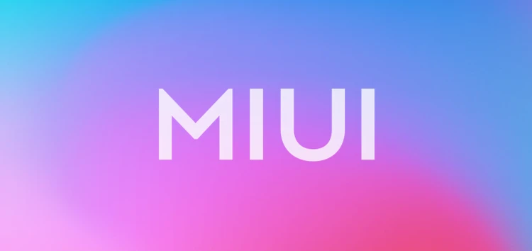
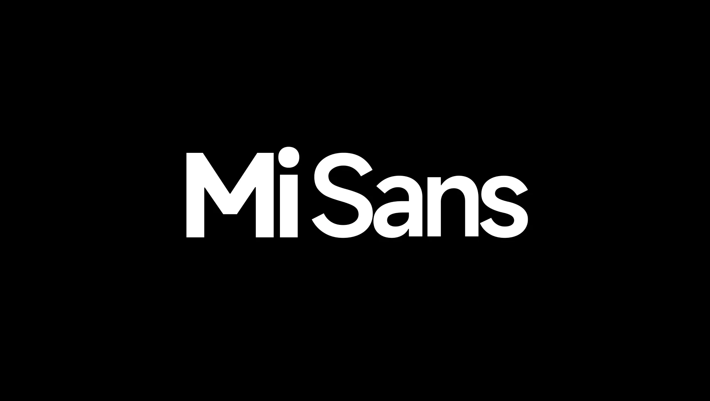

# MIUI

- **官方网站**：<https://home.miui.com/>
  - **MIUI12**：<https://miui12.home.miui.com/>
- **下载地址**：
  - **官方下载**：小米官方 **部分开放** 国际版 MIUI 的下载。只开放新上市机型的 MIUI 下载，而旧机型（比如小米 4）则没有开放下载链接。
    - **[MIUI 卡刷包](https://new.c.mi.com/global/miuidownload/index)**
      1. 点击右边的 「Select...」，选择手机名称
      2. 点击右边的「Submit」
      3. 点击「Download Full Rom」即可下载
    - **[MIUI 线刷包](https://new.c.mi.com/global/miuidownload/detail/guide/1)**
      1. 左上角切换到「Fastboot Update」，
      2. 在「STEP 2」下面即可找到 MIUI 线刷包的下载链接「手机名称 Latest 区域 Stable Version Fastboot File Download」
  - **第三方下载**：如果小米官方没有开放你对机型对应的下载链接，那么你应该可以在第三方 MIUI 下载站下载 MIUI 官方包：
    - **下载 ROM**：<https://xiaomirom.com/> <Badge type="tip" text="推荐" />
    - **[MIUI正式版刷机包汇总](https://xiaomishequ.feishu.cn/sheets/shtcnsRTbwSvpUsaei6B04ogI6Z)** <Badge type="tip" text="帖子汇总" />
    - **MIUI ROM 最新下载**：<https://miuirom.org/>
    - **MIUI 历史版本**：<https://miuiver.com/> <Badge type="warning" text="需要登录，安全性未知" />

## 屏幕截图

暂无截图

## 版本

| Android 版本 MIUI 版本 |  4.4  |  5.0  |   8   |   9   |  10   |  11   |  12   |  13   |  14   |
| ------------------------- | :---: | :---: | :---: | :---: | :---: | :---: | :---: | :---: | :---: |
| MIUI 14                   |   X   |   X   |   X   | 未知  | 未知  | 未知  | 未知  |   √   |   √   |
| MIUI 13                   |   X   |   X   |   X   | 未知  | 未知  |   √   |   √   | 未知  | 未知  |
| MIUI 12.5                 | 未知  | 未知  | 未知  | 未知  |   √   |   √   | 未知  | 未知  | 未知  |
| MIUI 12                   | 未知  | 未知  | 未知  |   √   |   √   | 未知  | 未知  | 未知  | 未知  |
| MIUI 11                   | 未知  | 未知  | 未知  | 未知  | 未知  | 未知  | 未知  | 未知  | 未知  |
| MIUI 10                   | 未知  | 未知  | 未知  | 未知  |   X   |   X   |   X   |   X   |   X   |
| MIUI 9                    | 未知  | 未知  |   X   |   X   |   X   |   X   |   X   |   X   |   X   |
| MIUI 8                    | 未知  | 未知  |   X   |   X   |   X   |   X   |   X   |   X   |   X   |
| MIUI 7                    |   √   |   √   |   X   |   X   |   X   |   X   |   X   |   X   |   X   |

### 发布时间

| MIUI | MIUI v4   | MIUI v5  | MIUI 6    | MIUI 7    | MIUI 8    | MIUI 9    | MIUI 10   | MIUI 11   | MIUI 12   | MIUI 13    | MIUI 14    |
| ---- | --------- | -------- | --------- | --------- | --------- | --------- | --------- | --------- | --------- | ---------- | ---------- |
| 日期 | 2012.1.20 | 2013.3.1 | 2014.8.16 | 2015.8.13 | 2016.5.10 | 2017.7.26 | 2018.5.31 | 2019.9.24 | 2020.4.27 | 2021.12.28 | 2022.12.11 |

## 设计

### 字体

#### Mi Sans <Badge text="最新" />

- 字重：Thin / Extralight / Light / Normal / Regular / Medium / DemiBold / SemiBold / Bold / Heavy
- 语言：简体中文 / 拉丁 / 西里尔 / 希腊
- [定制字体 - 汉仪字库](https://www.hanyi.com.cn/orderFont)

#### 小米兰亭 Pro

### 动画

- [MIUI 动画解析][animation] - 哔哩哔哩：@STRAY_数码

## 评价

<Score :scoreList="scoreList" />

### 优点

- 可以关闭纯净模式

### 缺点

- 无统一的设计风格
- 广告超多，系统臃肿，有牛皮癣
- 系统版本无法准确对应安卓版本
- 对系统工具开发者不友好
- 拥有 MIUI 专属的开屏广告

## API 变更

### 状态栏

| 版本   | 行为             |
| ------ | ---------------- |
| ？？？ | 无单色状态栏图标 |

### 文件

| 版本   | 行为                                  |
| ------ | ------------------------------------- |
| ？？？ | 无法使用 SAF 框架选择器，“文件”被禁用 |

### 软件

| 版本   | 行为          |
| ------ | ------------- |
| ？？？ | 无法安装 APKS |

### 分享

| 版本           | 行为                           |
| -------------- | ------------------------------ |
| ？？？- MIUI14 | 通常情况下不会调用“sharesheet” |

### 桌面

| 版本            | 行为                               |
| --------------- | ---------------------------------- |
| ？？？- MIUI 14 | 默认阻止软件固定创建快捷方式       |
| ？？？- MIUI 14 | 用户无法拖动固定应用快捷方式到桌面 |

## 相关链接

- 百科
  - MIUI: [360百科](https://baike.so.com/doc/5369087-5604931.html) |
    [百度百科](https://baike.baidu.com/item/MIUI/8150208) |
    [搜狗百科](https://baike.sogou.com/v20466533.htm)
  - [小米MIUI系统历代版本（部分）](https://baike.baidu.com/starmap/view?nodeId=a642e1fb59464a392c6f812d) - 百度百科

## 参考链接

- [网传小米 MIUI 13 测试版曝光：安卓 12、安卓 11 两个版本][13-RS]
- [难分伯仲？iOS VS MIUI 动画解析对比（超详细）][animation] - 哔哩哔哩：@STRAY_数码
- [MIUI十年发展史——写在MIUI12发布之际](https://zhuanlan.zhihu.com/p/136376710) - 知乎：@逆铭

[animation]: https://www.bilibili.com/video/BV12h411e7p1/
[13-RS]: https://post.smzdm.com/p/aenzx5xz/

声明：图片均来源于网络。如果侵犯了您的权力，请[联系我](mailto:jesse205@qq.com)，我会尽快删除。

