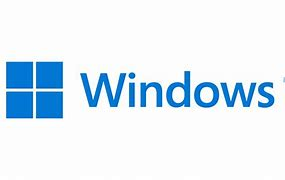

# Windows

在Mindows工具箱推出后，刷机界又多了一个重量级的操作系统：Windows。

* __官方网站__：<https://www.microsoft.com/zh-cn/windows/>
* __下载地址__：<https://www.microsoft.com/zh-cn/software-download/windows11>
* __Mindows 工具箱__：<https://mindows.cn/>

## 设计

### 用户界面：Fluent Design 、Windows 设计

* [Fluent 2 设计文档](https://fluent2.microsoft.design/)
* [Windows 11 设计指南](https://learn.microsoft.com/zh-cn/windows/apps/design/)
* [Windows 7 设计指南](https://learn.microsoft.com/zh-cn/windows/win32/uxguide/guidelines)

## 评价

<Score :scoreList="scoreList" />

### 优点

* 较完美的 Fluent Design 设计，但是部分界面残留着老的设计
* 拥有录音机、录屏、计算器等常用工具

### 缺点

* 有少部分广告和牛皮癣
* 付费激活
* 必须使用微软账号登录

