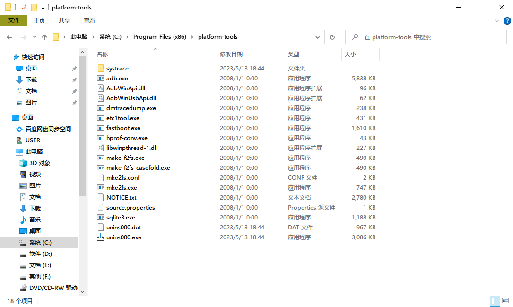
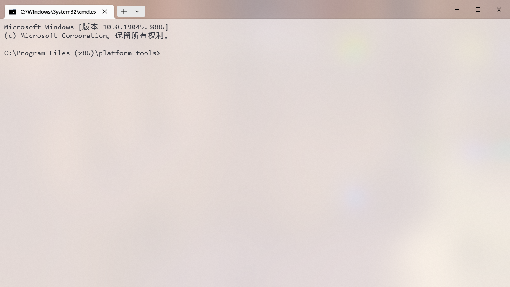

# Platform-Tools <Badge type="tip" text="命令行工具" />

Android SDK Platform-Tools 是 Android SDK 的一个组件。它包含与 Android 平台进行交互的工具。

**ADB 与 Fastboot 组件包含在 Platform-Tools 内。**

* [官方资料](https://developer.android.google.cn/studio/command-line/adb?hl=zh_cn)
* [官网下载](https://developer.android.google.cn/studio/releases/platform-tools?hl=zh-cn#downloads)（Platform-Tools 内包含以下所有工具）
* [Android_SDK_Platform_Tools_v33.0.0.exe](https://www.123pan.com/s/G7a9-4pek) - 123 云盘 <Badge type="tip" text="本站封装" />

## Platform-Tools 下载与安装

::: tip
Android Studio 会自动下载 Platform-Tools。如果您曾今使用过 Android Studio，则**无需手动安装此工具**。（如果您不知道 Android Studio 是什么，则说明此消息对您无用，您**需要继续阅读下面的内容**）
:::

### 一键安装 <Badge type="tip" text="对小白友好" />

您可以下载第三方封装好的版本，傻瓜式安装，推荐小白使用：

* [Android_SDK_Platform_Tools_v33.0.0.exe](https://www.123pan.com/s/G7a9-4pek) - 123 云盘 <Badge type="tip" text="本站封装" />

::: warning
通过傻瓜式安装的 Platform-Tools 版本可能低于官网版本，小部分功能可能无法使用。
:::

### 原始方法安装

1. 首先进入官网下载 Platform-Tools 压缩包
    * [官网下载](https://developer.android.google.cn/studio/releases/platform-tools?hl=zh-cn#downloads)（Platform-Tools 内包含 ADB）
    

    
    
    

    ::: tip
    官方 Platform-Tools 是绿色版本，您可以将下载的压缩包解压到任何地方，但是**一定不要删除这些文件**！
    :::
2. 下载完成之后，您可以按照这篇文章配置环境变量：[《Win11配置ADB环境变量教程》](https://zhuanlan.zhihu.com/p/433391556)
    ::: tip
    如果您只是临时使用，您可以直接在地址栏中输入 `cmd` ，在 Platform-Tools 所在目录下启动命令提示符，直接使用相关软件（如 `adb.exe` ）。

    

    

    :::

---

::: tip
配置好 ADB 后，您可能还需要[安装或修复驱动](/normal/drivers/index.md)
:::

## ADB 工具

有关 ADB 工具的更多用法，请参考[《ADB 介绍》](/normal/danger_permissions/adb/index.md)

### adb 帮助文件

<!--@include: ./help/adb.exe.md -->

## fastboot 工具

### fastboot 帮助文件

<!--@include: ./help/fastboot.exe.md -->

## 版权声明

本文档已获得 [@灬只会刷机养老](http://www.coolapk.com/u/11090720) 授权搬运并修改整理

## 相关链接

* [常见问题与解答 > 文档说明：命令的使用](/faq/documents.md#命令的使用)
* [Android 调试桥 (adb)](https://developer.android.google.cn/studio/command-line/adb?hl=zh_cn) - Android 开发者
* [SDK 平台工具版本说明](https://developer.android.google.cn/studio/releases/platform-tools?hl=zh-cn) - Android 开发者

## 参考链接

* [ADB](https://baike.baidu.com/item/ADB/23427792) - 百度百科
* [Android 调试桥 (adb)](https://developer.android.google.cn/studio/command-line/adb?hl=zh_cn) - Android 开发者
* [SDK 平台工具版本说明](https://developer.android.google.cn/studio/releases/platform-tools?hl=zh-cn) - Android 开发者
* [【小白搞机入门】第四期-配置adb环境和fastboot环境（Android SDK）](https://www.coolapk.com/feed/42768600?shareKey=MWVmYTc4NjFjZjVhNjQ4YTAwMjA~) - 酷安：@灬只会刷机养老
