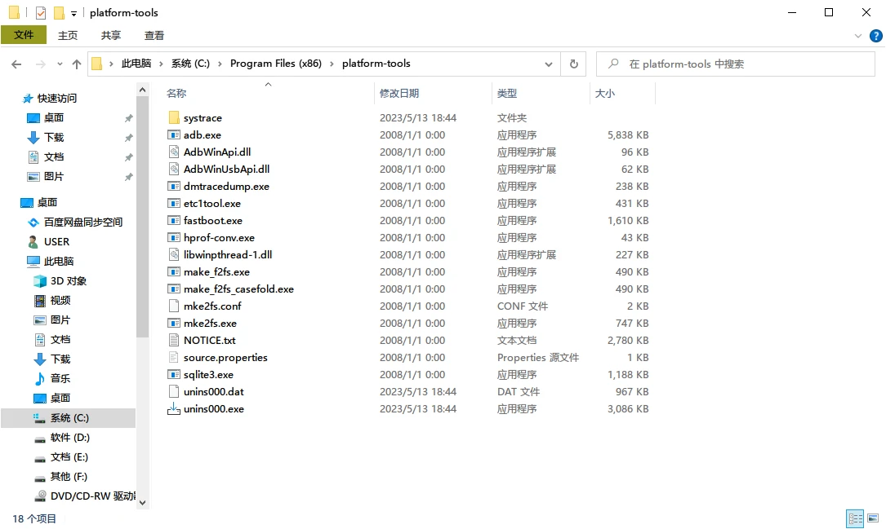
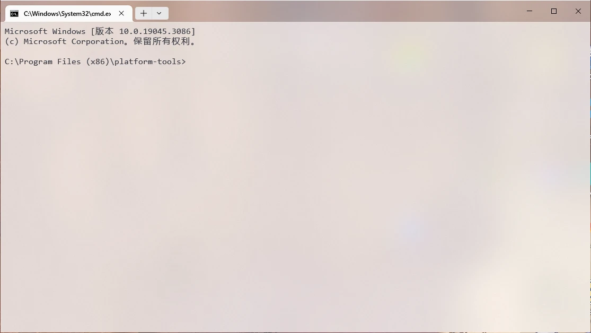

# Platform-Tools <Badge type="tip" text="命令行工具" />

Android SDK Platform-Tools 是 Android SDK 的一个组件。它包含与 Android 平台进行交互的工具。

::: tip
adb 与 fastboot 组件包含在 Platform-Tools 内。
:::

- [官方 ADB 资料](https://developer.android.google.cn/studio/command-line/adb?hl=zh_cn)
- [官方 ADB 资料](https://developer.android.google.cn/tools/adb) <Badge text="新版，暂无中文" />
- [官网下载][OfficialDownload]（Platform-Tools 内包含 ADB 等所有工具）
  - 封装版本：[Android_SDK_Platform_Tools_v33.0.0.exe](https://www.123pan.com/s/G7a9-4pek) - 123 云盘 <Badge type="tip" text="本站封装" />
- [基础知识 > 危险权限 > ADB 介绍](/normal/danger_permissions/adb/index.md) - 刷机指南



## Platform-Tools 下载与安装

::: tip
Android Studio 会自动下载 Platform-Tools。如果您曾今使用过 Android Studio，则**可能无需手动下载此工具**，直接配置环境变量即可。\
（如果您不知道 Android Studio 是什么，则说明此消息对您无用，您**需要继续阅读下面的内容**）
:::

> 部分工具、工具箱、手机助手内自带 ADB 组件，而 Platform-Tools 内其他组件很少用得到，因此大部分情况下您**无需手动安装 Platform-Tools**。

### 一键安装 <Badge text="对小白友好" />

#### Windows 一键安装

您可以下载第三方封装好的版本，傻瓜式安装，推荐小白使用：

- [Android_SDK_Platform_Tools_v33.0.0.exe](https://www.123pan.com/s/G7a9-4pek) - 123 云盘 <Badge text="本站封装" />

本站封装的版本可以直接在控制面板中卸载，卸载后会自动移除环境变量

::: warning
通过傻瓜式安装的 Platform-Tools 版本可能低于官网版本，小部分功能可能无法使用。
:::

<!-- TODO: 一键安装工具，自动下载最新版本 -->

#### Linux 一键安装

您可以使用 `apt` 等包管理器一键安装

::: code-group

``` bash{3} [apt]
sudo apt update
sudo apt upgrade
sudo apt install android-sdk-platform-tools
```

:::

::: tip
使用包管理工具安装的 Platform-tools 不包含 adb，您可能需要手动安装 adb。

``` bash:no-line-numbers [apt]
sudo apt install adb
```

:::

#### Android 一键安装

没错，安卓也可以用此工具。借助此特性，您甚至可以拿一台安卓手机给另一台安卓手机解锁、刷机。

- Magisk 模块：提供 Magisk 安装的 ADB 或者其他工具在整个操作系统内是共享的，您可以在几乎任何地方使用。
- 第三方工具：第三方工具通常提供内置的 ADB 组件。部分工具也提供写入到系统的功能，但是这可能破坏系统，建议使用 Magisk 模块代替。
- Termux、MT 管理器：与 Linux 相同，但是您也可以使用 Termux 专属的 `pkg` 来安装 ADB。

### 原始方法安装

1. 首先进入[官网下载 Platform-Tools 压缩包][OfficialDownload]（Platform-Tools 内包含 ADB）
    <div class="screenshotList pad">
    
    
    </div>

    ::: tip
    官方 Platform-Tools 是绿色版本，您可以将下载的压缩包解压到任何地方，但是**一定不要删除这些文件**！
    :::
2. 下载完成之后，您可以按照这篇文章配置环境变量：[《Win11配置ADB环境变量教程》](https://zhuanlan.zhihu.com/p/433391556)
    ::: tip
    如果您只是临时使用，您可以直接在地址栏中输入 `cmd` ，在 Platform-Tools 所在目录下启动命令提示符，直接使用相关软件（如 `adb.exe` ）。

    

    

    :::

---

::: tip
配置好 ADB 后，您可能还需要[安装或修复驱动](/normal/drivers/index.md)
:::

### 检测工具是否被正常安装

1. 打开[终端][终端]，在 Windows 中为 `Windows 终端` 、`终端` 、`命令提示符`（也叫 cmd）
2. 运行命令 `adb version` ，如果弹出了版本信息，则说明安装成功

::: code-group

``` cmd:no-line-numbers{1} [命令提示符]
C:\Users\USER>adb version
Android Debug Bridge version 1.0.41
Version 33.0.0-8141338
Installed as C:\Program Files (x86)\platform-tools\adb.exe
```

``` ps:no-line-numbers{1} [PowerShell]
PS C:\Users\USER> adb version
Android Debug Bridge version 1.0.41
Version 33.0.0-8141338
Installed as C:\Program Files (x86)\platform-tools\adb.exe
```

``` bash:no-line-numbers{1} [Linux: Bash]
user@DESKTOP-93UT1LQ:~$ adb version
Android Debug Bridge version 1.0.41
Version 28.0.2-debian
Installed as /usr/lib/android-sdk/platform-tools/adb
```

:::

> 实际的版本号与示例不匹配没关系，大部分情况不影响使用。

## ADB 工具

有关 ADB 工具的更多用法，请参考以下链接：

- [基础知识 > 危险权限 > ADB](/normal/danger_permissions/adb/index.md) - 刷机指南
- [官方 ADB 资料](https://developer.android.google.cn/studio/command-line/adb?hl=zh_cn) - Android 开发者
- [官方 ADB 资料](https://developer.android.google.cn/tools/adb) <Badge text="新版，暂无中文" /> - Android 开发者

<!--@include: ./help/adb.exe.md -->

## fastboot 工具

<!--@include: ./help/fastboot.exe.md -->

## 版权声明

本文档已获得 [@灬只会刷机养老](http://www.coolapk.com/u/11090720) 授权搬运并修改整理

## 相关链接

- [常见问题与解答 > 文档说明：命令的使用](/faq/documents.md#命令的使用)
- [基础知识 > 名词集：命令与终端][终端]
- [Android 调试桥 (adb)](https://developer.android.google.cn/studio/command-line/adb?hl=zh_cn) - Android 开发者
- [Android 调试桥 (adb) (新版)](https://developer.android.google.cn/tools/adb) <Badge type="tip" text="英文" /> - Android 开发者
- [SDK 平台工具版本说明](https://developer.android.google.cn/studio/releases/platform-tools?hl=zh-cn) - Android 开发者

[终端]: /normal/noun.md#命令与终端

## 参考链接

- [ADB](https://baike.baidu.com/item/ADB/23427792) - 百度百科
- [Android 调试桥 (adb)](https://developer.android.google.cn/studio/command-line/adb?hl=zh_cn) - Android 开发者
- [SDK 平台工具版本说明](https://developer.android.google.cn/studio/releases/platform-tools?hl=zh-cn) - Android 开发者
- [【小白搞机入门】第四期-配置adb环境和fastboot环境（Android SDK）](https://www.coolapk.com/feed/42768600?shareKey=MWVmYTc4NjFjZjVhNjQ4YTAwMjA~) - 酷安：@灬只会刷机养老

[OfficialDownload]: https://developer.android.google.cn/studio/releases/platform-tools?hl=zh-cn#downloads
