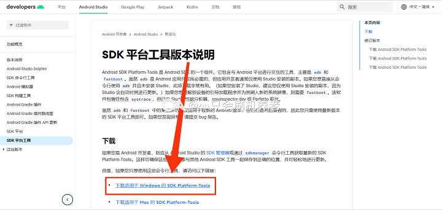
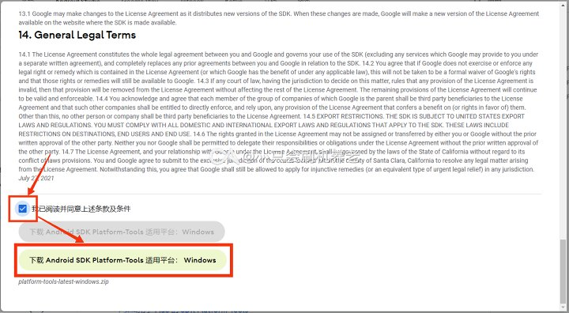
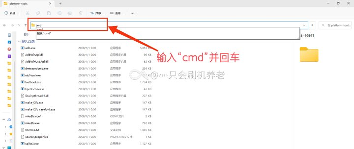

# Platform-Tools <Badge type="tip" text="命令行工具" />

Android SDK Platform-Tools 是 Android SDK 的一个组件。它包含与 Android 平台进行交互的工具。

* [官方资料](https://developer.android.google.cn/studio/command-line/adb?hl=zh_cn)
* [官网下载](https://developer.android.google.cn/studio/releases/platform-tools?hl=zh-cn#downloads)（Platform-Tools 内包含以下所有工具）
* [Android_SDK_Platform_Tools_v33.0.0.exe](https://www.123pan.com/s/G7a9-4pek) - 123 云盘 <Badge type="tip" text="本站封装" />

## Platform-Tools 下载

::: tip
Android Studio 会自动下载 Platform-Tools。如果您曾今使用过 Android Studio，则无需手动安装此工具。
:::

* [官网下载](https://developer.android.google.cn/studio/releases/platform-tools?hl=zh-cn#downloads)（Platform-Tools 内包含 ADB）

::: tip
官方 Platform-Tools 下载下来是绿色版本。您可以将下载下来压缩包解压到任何地方，但是一定不要删除这些文件！
:::

下载完成之后，您可以按照这篇文章配置环境变量：[《Win11配置ADB环境变量教程》](https://zhuanlan.zhihu.com/p/433391556)

::: tip
如果您只是临时使用，您可以直接在地址栏中输入 `cmd` ，在当前目录下启动命令提示符，直接使用相关软件。

:::

您也可以下载第三方封装好的版本，傻瓜式安装：

* [Android_SDK_Platform_Tools_v33.0.0.exe](https://www.123pan.com/s/G7a9-4pek) - 123 云盘 <Badge type="tip" text="本站封装" />

## ADB 工具

有关 ADB 工具的更多用法，请参考[《ADB 介绍》](/normal/danger_permissions/adb/index.md)

### adb 帮助文件

<!--@include: ./help/adb.exe.md -->

## fastboot 工具

### fastboot 帮助文件

<!--@include: ./help/fastboot.exe.md -->

## 相关链接

* 文档教程：[命令的使用](../faq/documents.md#命令的使用)
* [Android 调试桥 (adb)](https://developer.android.google.cn/studio/command-line/adb?hl=zh_cn) - Android 开发者
* [SDK 平台工具版本说明](https://developer.android.google.cn/studio/releases/platform-tools?hl=zh-cn) - Android 开发者

## 参考链接

* [ADB](https://baike.baidu.com/item/ADB/23427792) - 百度百科
* [Android 调试桥 (adb)](https://developer.android.google.cn/studio/command-line/adb?hl=zh_cn) - Android 开发者
* [SDK 平台工具版本说明](https://developer.android.google.cn/studio/releases/platform-tools?hl=zh-cn) - Android 开发者
* [【小白搞机入门】第四期-配置adb环境和fastboot环境（Android SDK）](https://www.coolapk.com/feed/42768600?shareKey=MWVmYTc4NjFjZjVhNjQ4YTAwMjA~)
